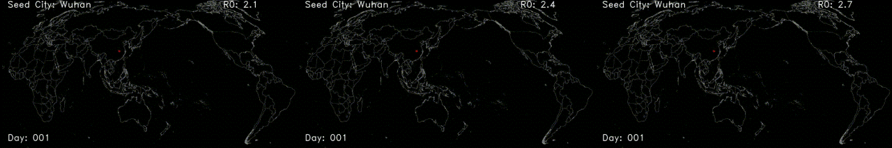
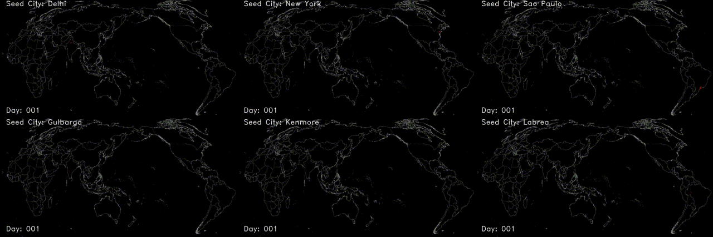

  <h1 align="center">Global age-structured spatial modeling of emerging infectious diseases (EIDs) like COVID-19
</h1>

  <h3 align="center">Global pandemic simulation network
</h3>

  <h3 align="center">Baseline scenarios
</h3>

  <h3 align="center">Baseline scenarios with different seed origins
</h3>

## Abstract
Modeling the global dynamics of emerging infectious diseases (EIDs) like COVID-19 can provide important guidance in the preparation and mitigation of pandemic threats. While age-structured transmission models are widely used to simulate the evolution of EIDs, most of these studies focus on the analysis of specific countries and fail to characterize the spatial spread of EIDs across geographic regions. Here, we developed a global pandemic simulator that integrates age-structured disease transmission models across 3,157 cities and explored its usage under several scenarios. We found that without mitigations, EIDs like COVID-19 are highly likely to cause profound global impacts. For pandemics seeded in most cities, the impacts are equally severe by the end of the first year. The result highlights the urgent need for strengthening global infectious disease monitoring capacity to provide early warnings of future outbreaks. Additionally, we found that the global mitigation efforts could be easily hampered if developed countries or countries near the seed origin take no control. These countries could cause up to 9.45 million additional infections in other countries.  The result indicates that successful pandemic mitigations require collective efforts across geographic regions. The role of developed countries is vitally important as their passive responses may significantly impact other countries.
## Citation
